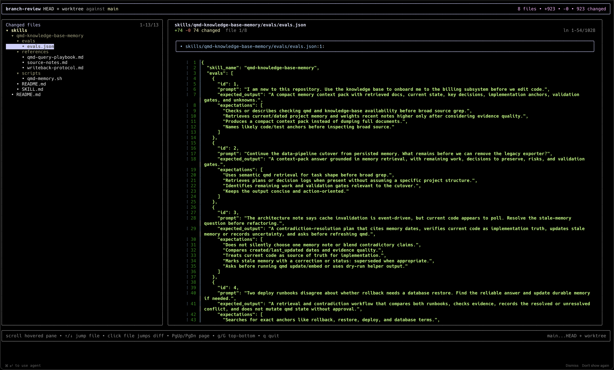

# branch-review

Review your branch like a pull request before you push it.



`branch-review` is a terminal UI for doing a focused, local review of your Git changes. It is built for developers who live in the terminal and want a cleaner final review pass than raw `git diff`, without switching to GitHub or using a full Git dashboard.

It is especially useful when AI agents made a lot of edits and you want a fast human pass over exactly what changed.

## Why this exists

GitHub has a great code review reading experience.

But a lot of code gets reviewed too late:

- after you already pushed
- after you already opened a PR
- after an AI tool touched 20 files and you want to sanity-check the result locally

`branch-review` brings that review step into the terminal.

## What it does

- shows a file tree on the left and the current diff on the right
- compares a branch against any base ref
- supports `HEAD + worktree` review for local, unpushed changes
- includes untracked files in local review mode
- shows branch-wide and per-file change metrics
- supports mouse and keyboard navigation
- renders syntax-highlighted diffs through `git-delta`

## What it is not

`branch-review` is not trying to be a full Git client.

If you want to stage files, manage stashes, rebase, cherry-pick, and do general repository operations, tools like `lazygit`, `gitui`, or `tig` are better fits.

`branch-review` is focused on one job:

**reading and reviewing changes well before push or PR creation.**

## Requirements

- Node.js 20+
- Git available on your `PATH`
- [`git-delta`](https://github.com/dandavison/delta) available on your `PATH`

macOS:

```sh
brew install git-delta
```

## Install

### pnpm

```sh
pnpm add -g branch-review
```

### one-off usage

```sh
pnpm dlx branch-review
```

This installs the `branch-review` binary.

## Usage

Run inside a Git repository:

```sh
branch-review
```

Default behavior:

- branch: `HEAD`
- base: the detected base branch

Base detection uses `origin/HEAD` when available, then falls back to common branch names such as `development`, `main`, `master`, and `trunk`.

Examples:

```sh
branch-review                      # HEAD + worktree vs detected base
branch-review my-feature           # my-feature vs detected base
branch-review my-feature main      # my-feature vs main
branch-review HEAD main            # current local worktree vs main
```

Ref resolution behavior:

- tries local refs first
- falls back to `origin/<ref>` when available

So you can review against remote-only base branches without checking them out first.

## Navigation

| Key | Action |
| --- | --- |
| `↑` / `↓` | jump to previous / next file |
| `j` / `k` | scroll diff down / up |
| `PgDn` / `PgUp` | page down / up |
| `g` / `G` | jump to top / bottom |
| click file | jump diff to that file |
| trackpad / mouse wheel | scroll hovered pane |
| `q` / `Esc` | quit |

## Typical workflows

### Review your current local changes before push

```sh
branch-review
```

Good for:

- end-of-task review
- AI-generated changes
- checking untracked files before commit or push

### Review a feature branch against `main`

```sh
branch-review my-feature main
```

Good for:

- pre-PR review
- stacked branch sanity checks
- seeing the exact scope of a branch before publishing it

### Review against a remote base without checking it out

```sh
branch-review my-feature release/2026.04
```

If the local ref is missing, `branch-review` will try `origin/release/2026.04`.

## How it works

`branch-review` uses Git directly for file discovery and metrics, then pipes file diffs through `delta` for rendering.

High-level flow:

- `git diff --name-only` builds the changed file list
- `git diff --numstat` builds file and branch metrics
- `git diff --color=always ... -- <file>` renders each file diff
- `delta` turns that diff into a more readable terminal review view

## Development

```sh
pnpm install
pnpm dev
pnpm build
pnpm test
```

Try the locally linked CLI:

```sh
pnpm build
pnpm link --global
branch-review
```

## License

MIT © hcastro
